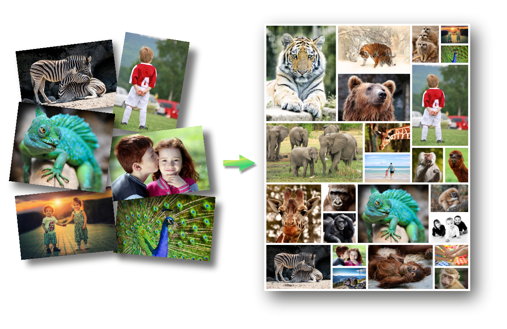
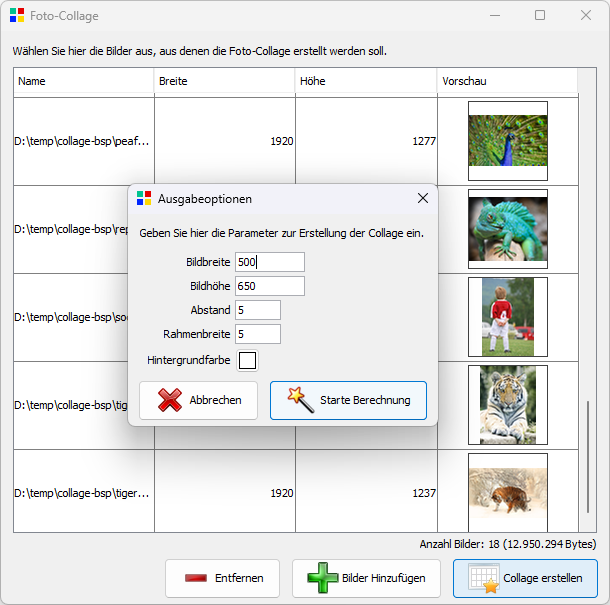
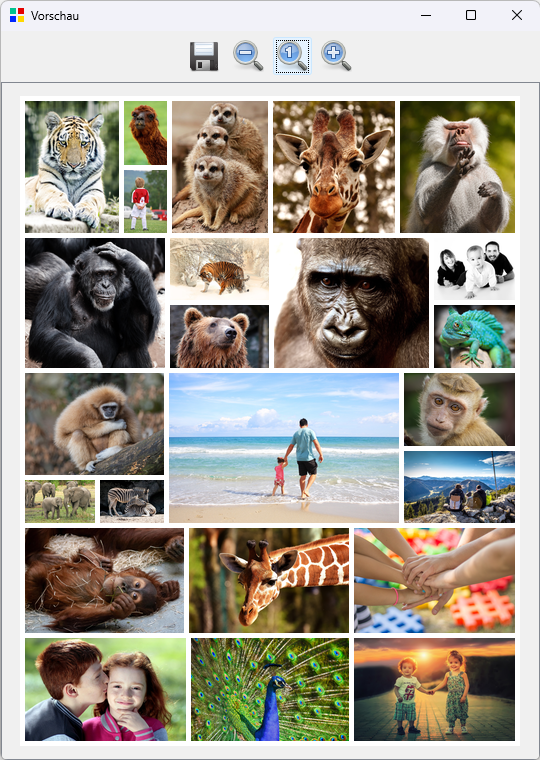

# Fotocollage

Tool zur Erstellung einer Collage aus beliebigen Bildern zu einer großen Leinwand.

*(Quelle der Fotos: [pixabay](https://pixabay.com))*

---

[Infos zur Entwicklung](docs/entwicklung.md)
